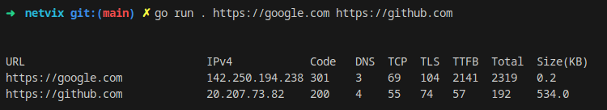

# NetVix — Network Performance Visualizer (CLI Tool)

**NetViz** is a terminal-based tool I built to see how long a website takes to respond, and *why*. Is it DNS? TLS? TCP? Something else?

Built with Go, it gives a clear breakdown of what's happening under the hood when your browser (or HTTP client) connects to a site. 

## Features
* Supports single or multiple URLs
* Measures:
    - DNS resolution time
    - TCP connection time
    - TLS handshake time
    - Time to First Byte (TTFB)
    - Total request duration
    - Response body size (in KB)
* Shows resolved IPv4 address

### Here's what it looks like in action:

```bash
$ ./netviz https://google.com https://github.com
```


It works for **one or multiple URLs** and helps you compare performance at a glance.

## How to Use It
### Build it

```bash
git clone https://github.com/my-systems-journey/netviz.git
cd netviz
go build -o netviz
```

### Run it

```bash
./netviz https://google.com https://github.com
```

You'll see:

* The URL
* Its IPv4 address
* HTTP status code
* DNS / TCP / TLS / TTFB / Total time (all in ms)
* Size of the response body (in KB)

## Final Thoughts

This was a hands-on way to understand real-world HTTP behavior and Go’s low-level capabilities. If you're a dev learning Go or just want to know *why that website is slow*, this tool might be useful.

If you're reading this — feel free to fork it, break it, improve it, or build your own version.

## References
* [Go blog on httptrace](https://blog.golang.org/http-tracing)
* [Go's net/http/httptrace package docs](https://pkg.go.dev/net/http/httptrace)
